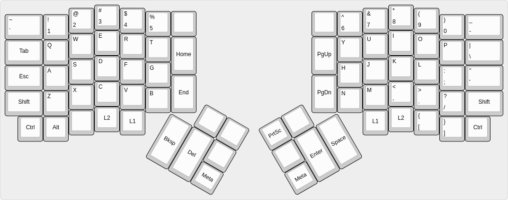

# MrAlias Ergodox Layout

## Layout

### Base Layer

[Open on keyboard-layout-editor.com](https://www.keyboard-layout-editor.com/#/gists/a582a0c7562feb6d4b5038a9dcafc170)



## Building

```bash
$ git clone git@github.com:qmk/qmk_firmware.git
$ cd qmk_firmware
$ git clone git@github.com:MrAlias/ergodox-layout.git keyboards/ergodox_ez/keymaps/MrAlias
$ make keyboard=ergodox_ez keymap=MrAlias
```
